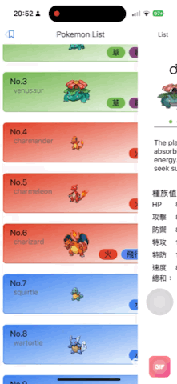

# Pok-mon

### Description

>This project is an iOS application developed using Swift and Xcode. It is compatible with iOS 17 and later versions.


### Features
1. PokemonList 


2. Pokemon Detail 



### Installation

Clone the repository.
```bash
 git clone https://github.com/viocax/Pok-mon
 pod install
```
>Utilizing Chat GPT to organize JSON data sourced from the PokemonAPI