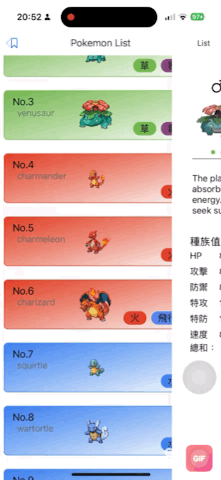

# Pok-mon

### Description

>This project is an iOS application developed using Swift and Xcode. It is compatible with iOS 17 and later versions.


### Features
1. PokemonList 


2. Pokemon Detail 



### Installation

Clone the repository and open the project. Dependencies are managed by Swift
Package Manager, so Xcode resolves them on first open — there is no install step.

```bash
git clone https://github.com/viocax/Pok-mon
open Pokmon.xcodeproj
```

Build and test from the command line:

```bash
xcodebuild build -project Pokmon.xcodeproj -scheme Pokmon \
  -destination 'platform=iOS Simulator,name=iPhone 17'
xcodebuild test  -project Pokmon.xcodeproj -scheme Pokmon \
  -destination 'platform=iOS Simulator,name=iPhone 17'
```
>Utilizing Chat GPT to organize JSON data sourced from the PokemonAPI
